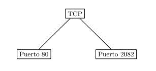
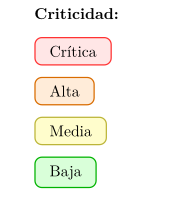
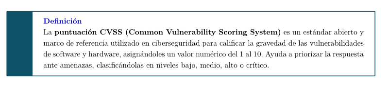
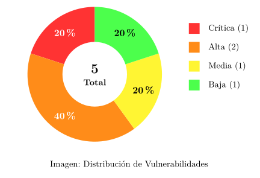
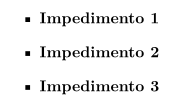

# plantilla-informe-latex
Plantilla para informes de auditorías de pentesting en LaTeX.
---------
El archivo PDF es la muestra de cómo queda.
En el inicio del código de la plantilla hay varios comentarios con bloques de código indicando qué hacen para usarlos en el resto del informe.
También están reflejados el final de este mismo documento.

Comandos a ejecutar:
``` bash
mkdir plantilla
git clone https://github.com/t0chka1312/plantilla-informe-latex
cd plantilla-informe-latex
latexmk -pdf plantilla.tex -pvc -> Para compilar y ver cambios

En caso de error:
latexmk -C
latexmk -pdf plantilla.tex -> Después con la opción -pvc
```

También está el comprimido con la estructura completa, en caso de usar el comprimido:

``` bash
mkdir plantilla
mv plantilla_informe_LaTeX.zip plantilla
cd plantilla
unzip plantilla_informe_LaTeX.zip
```

## Bloques de código reutilizables
---------

Bloque para insertar imagen
``` latex
\begin{figure}[h]
  \centering
  \setlength{\fboxrule}{0.8pt}
  \fbox{\includegraphics[width=\textwidth]{images/[NOMBRE IMAGEN].png}}
  \caption{[TEXTO PIE DE IMAGEN]}
\end{figure}
```
<p align="center">
  
</p>

Bloque para insertar cuadro de URL personalizado
``` latex
\begin{tcolorbox}[enhanced,attach boxed title to top center={yshift=-3mm,yshifttext=-1mm},
  colback=blue!5!white,colframe=blue!75!black,colbacktitle=bluePortada!80!black,
  title=Dirección URL,fonttitle=\bfseries,
  boxed title style={size=small,colframe=bluePortada!50!black} ]
  \centering
    \href{https://example.com}{\textbf{\color{bluePortada}Dirección URL de Partida}}
\end{tcolorbox}
```
<p align="center">
  
</p>

Bloque para insertar nodos unidos por líneas
``` latex
  \centering
  \begin{tikzpicture}[node distance=2cm, every node/.style={rectangle, draw, fill=white}]
    \node (center) {TCP};
    \node (port1) [below left of=center, node distance=3cm] {Puerto 80};
    \node (port2) [below right of=center, node distance=3cm] {Puerto 2082};
    \draw (center) -- (port1);
    \draw (center) -- (port2);
  \end{tikzpicture}
```
<p align="center">
  
</p>

Tipos de criticidades por colores
``` latex
\criticaBadge{Crítica}
\altaBadge{Alta}
\mediaBadge{Media}
\bajdaBadge{Baja}
```
<p align="center">
  
</p>

Bloque para insertar tabla
``` latex
 \begin{longtable}{llll}
    \toprule
    \textbf{ID} & \textbf{Vulnerabilidad} & \textbf{Severidad} & \textbf{CVSS} \\
    \midrule
    \endhead

      V-01 & SQL Injection en login & Crítica & 9.8 \\
      V-02 & XSS Reflejado & Alta & 7.4 \\
      V-03 & Credenciales por defecto & Alta & 8.1 \\
      V-04 & Enumeración de usuarios & Media & 5.3 \\
      V-05 & Información sensible expuesta & Baja & 3.1 \\

    \bottomrule
    \caption{Resumen de Vulnerabilidades Identificadas} \\
  \end{longtable}
```
<p align="center">
  
</p>

Bloque para insertar cuadro de definición
``` latex
½ En el preámbulo:
\newtcolorbox{definicion}{
  breakable,
  enhanced,
  colback=white,
  colframe=bluePortada!75!black,
  arc=0mm,
  boxrule=1pt,
  leftrule=12mm,
  fonttitle=\bfseries,
  coltitle=blue!75!black,
  title=Definición,
  attach title to upper=\par,
}
% En el código principal:
\begin{definicion}
    La \textbf{puntuación CVSS (Common Vulnerability Scoring System)} es un estándar abierto y marco de referencia utilizado en ciberseguridad para calificar la gravedad de las vulnerabilidades de software y hardware, asignándoles un valor numérico del 1 al 10. Ayuda a priorizar la respuesta ante amenazas, clasificándolas en niveles bajo, medio, alto o crítico.
\end{definicion}
```
<p align="center">
  
</p>

Bloque para insertar gráfico ciruclar con porcentajes
``` latex
\begin{minipage}{0.48\textwidth}
  \centering

  % ---- CÁLCULOS AUTOMÁTICOS ----
  \pgfmathtruncatemacro{\total}{\critica+\alta+\media+\baja}
  \pgfmathsetmacro{\totalSafe}{ifthenelse(\total==0,1,\total)}

  \pgfmathsetmacro{\angCrit}{\critica/\totalSafe*360}
  \pgfmathsetmacro{\angAlta}{\alta/\totalSafe*360}
  \pgfmathsetmacro{\angMedia}{\media/\totalSafe*360}
  \pgfmathsetmacro{\angBaja}{\baja/\totalSafe*360}

  \pgfmathsetmacro{\endCrit}{90+\angCrit}
  \pgfmathsetmacro{\endAlta}{\endCrit+\angAlta}
  \pgfmathsetmacro{\endMedia}{\endAlta+\angMedia}
  \pgfmathsetmacro{\endBaja}{\endMedia+\angBaja}

  \pgfmathtruncatemacro{\pCrit}{round(\critica/\totalSafe*100)}
  \pgfmathtruncatemacro{\pAlta}{round(\alta/\totalSafe*100)}
  \pgfmathtruncatemacro{\pMedia}{round(\media/\totalSafe*100)}
  \pgfmathtruncatemacro{\pBaja}{round(\baja/\totalSafe*100)}

  \begin{tikzpicture}

    % --- SECTORES ---
    \ifnum\critica>0
      \fill[red!80] (0,0) -- (90:2.5) arc (90:\endCrit:2.5) -- cycle;
    \fi

    \ifnum\alta>0
      \fill[orange!90] (0,0) -- (\endCrit:2.5) arc (\endCrit:\endAlta:2.5) -- cycle;
    \fi

    \ifnum\media>0
      \fill[yellow!80] (0,0) -- (\endAlta:2.5) arc (\endAlta:\endMedia:2.5) -- cycle;
    \fi

    \ifnum\baja>0
      \fill[green!70] (0,0) -- (\endMedia:2.5) arc (\endMedia:\endBaja:2.5) -- cycle;
    \fi

    % --- POSICIONES MEDIAS ---
    \pgfmathsetmacro{\midCrit}{90+\angCrit/2}
    \pgfmathsetmacro{\midAlta}{\endCrit+\angAlta/2}
    \pgfmathsetmacro{\midMedia}{\endAlta+\angMedia/2}
    \pgfmathsetmacro{\midBaja}{\endMedia+\angBaja/2}

    % --- PORCENTAJES ---
    \ifnum\critica>0
      \node at (\midCrit:1.9) {\textbf{\color{white}\pCrit\%}};
    \fi

    \ifnum\alta>0
      \node at (\midAlta:1.9) {\textbf{\color{white}\pAlta\%}};
    \fi

    \ifnum\media>0
      \node at (\midMedia:1.9) {\textbf{\pMedia\%}};
    \fi

    \ifnum\baja>0
      \node at (\midBaja:1.9) {\textbf{\pBaja\%}};
    \fi

    % --- AGUJERO CENTRAL ---
    \fill[white] (0,0) circle (1.2);

    % --- TOTAL ---
    \node at (0,0.2) {\Large \textbf{\total}};
    \node at (0,-0.3) {\small \textbf{Total}};

    % --- LEYENDA ---
    \begin{scope}[xshift=3.5cm, yshift=1.5cm]

    \ifnum\critica>0
      \fill[red!80] (0,0) rectangle (0.4,0.4);
      \node[right] at (0.6,0.2) {\small Crítica (\critica)};
    \fi

    \ifnum\alta>0
      \fill[orange!90] (0,-0.7) rectangle (0.4,-0.3);
      \node[right] at (0.6,-0.5) {\small Alta (\alta)};
    \fi

    \ifnum\media>0
      \fill[yellow!80] (0,-1.4) rectangle (0.4,-1.0);
      \node[right] at (0.6,-1.2) {\small Media (\media)};
    \fi

    \ifnum\baja>0
      \fill[green!70] (0,-2.1) rectangle (0.4,-1.7);
      \node[right] at (0.6,-1.9) {\small Baja (\baja)};
    \fi

  \end{scope}
  \end{tikzpicture}

  \vspace{0.3cm}
  {\small Gráfico 1: Distribución de Vulnerabilidades}

  \end{minipage}
}
  \end{center}
```
<p align="center">
  
</p>

Bloque para lista con puntos
``` latex
\begin{itemize}
  \item \textbf{Impedimento 1}
  \item \textbf{Impedimento 2}
  \item \textbf{Impedimento 3}
\end{itemize}
```
<p align="center">
  
</p>

Bloque para cambio de fuente para resaltación centrada
``` latex
\begin{center}
  \texttt{contact@example.com} \qquad \texttt{contact@votenow.local}
\end{center}
```
<p align="center">
  
</p>
