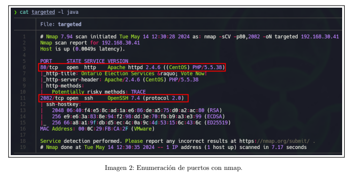

# plantilla-informe-latex
Plantilla para informes de auditorías de pentesting en LaTeX.
---------
El archivo PDF es la muestra de cómo queda.
En el inicio del código de la plantilla hay varios comentarios con bloques de código indicando qué hacen para usarlos en el resto del informe.
También están reflejados el final de este mismo documento.

Comandos a ejecutar:
``` bash
mkdir plantilla
git clone https://github.com/t0chka1312/plantilla-informe-latex
cd plantilla-informe-latex
latexmk -pdf plantilla.tex -pvc -> Para compilar y ver cambios

En caso de error:
latexmk -C
latexmk -pdf plantilla.tex -> Después con la opción -pvc
```

También está el comprimido con la estructura completa, en caso de usar el comprimido:

``` bash
mkdir plantilla
mv plantilla_informe_LaTeX.zip plantilla
cd plantilla
unzip plantilla_informe_LaTeX.zip
```

## Bloques de código reutilizables
---------

Bloque para insertar imagen
``` latex
\begin{figure}[h]
  \centering
  \setlength{\fboxrule}{0.8pt}
  \fbox{\includegraphics[width=\textwidth]{images/[NOMBRE IMAGEN].png}}
  \caption{[TEXTO PIE DE IMAGEN]}
\end{figure}
```
<p align="center">
  
</p>

Bloque para cuadro de URL personalizado
``` latex
\begin{tcolorbox}[enhanced,attach boxed title to top center={yshift=-3mm,yshifttext=-1mm},
  colback=blue!5!white,colframe=blue!75!black,colbacktitle=bluePortada!80!black,
  title=Dirección URL,fonttitle=\bfseries,
  boxed title style={size=small,colframe=bluePortada!50!black} ]
  \centering
    \href{https://example.com}{\textbf{\color{bluePortada}Dirección URL de Partida}}
\end{tcolorbox}
```
<p align="center">
  
</p>
